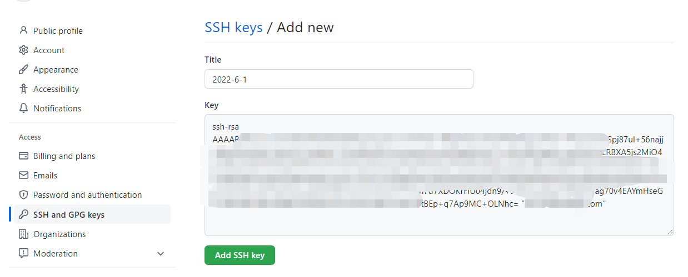
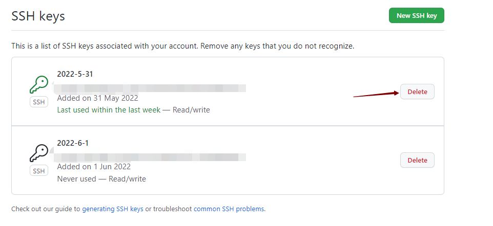

# Git 

## 记录

### 一、ssh连接取消每次密码验证

出现这种每次pull都要输入密码验证的


#### 1.重新配置密钥，注意不要输入密码！

执行

```git
ssh-keygen -t rsa -C ”yourEmail@emal.com”
```

Overwrite输入“y”，后面直接按回车，一定不要设置密码


#### 2.将新密钥复制到Github的SSH keys

执行

```
cat ~/.ssh/.ssh/id_rsa.pub
```


然后复制，并且在Github的SSH keys新建一个SSH keys把刚刚复制的填进去



#### 3.重新执行pull命令

不用输入密码了


#### 4.删除旧的Github的SSH keys

只保留一个Keygen



到此，成功把Git取消了每次pull和push都要输入密码验证


### 二、merge 报错

在main分支里面merge报错

```
git merge origin dev

fatal: refusing to merge unrelated histories

```


添加 --allow-unrelated-histories后可以正常push


```
git merge dev --allow-unrelated-histories

git push
```


如果是`git pull`或者`git push`报`fatal: refusing to merge unrelated histories`
同理：
`git pull origin master --allow-unrelated-histories`


### 三、Git 只修改首字母大小写进行重命名失败
**原因 - git默认是大小写不敏感**
当git上文件名大小写重命名的修改时（git大小写敏感/默认不敏感），如何重命名并提交

#### 解决方案1

git设置成大小写敏感 `git config core.ignorecase false`（其实这也是个坑）

git大小写不敏感，也就是默认的情况(建议默认)

#### 解决方案2

先重命名成其他名字，再修改回来。
例如

```
git mv test Test
报错： 
"Rename from 'test' to 'Test/test' failed. Should I try again? (y/n)"
可以先：
git mv test Test_
再：
git mv Test_ Test

```

通过这样来修改，达到只改变首字母的重命名的效果。

### 

